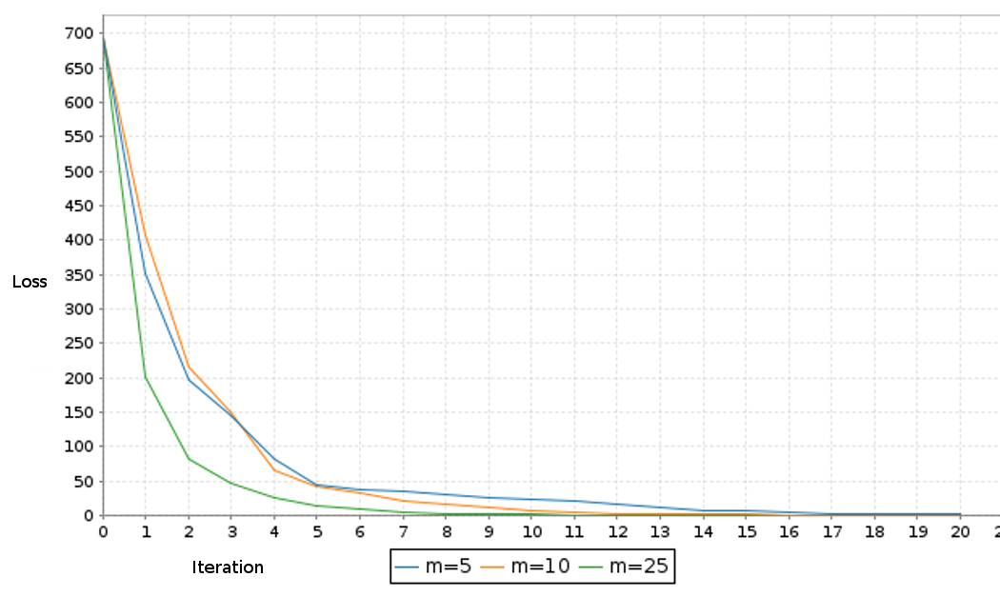

# newton-sketch: Scala

A Spark implementation of [Newton Sketch](https://arxiv.org/abs/1505.02250).
Currently supports logistic regression, with random projection sketch
matrices based on Gaussian-distributed random vectors.

Relies on [Breeze](https://github.com/scalanlp/breeze/) for linear algebra
routines.

## Usage:
To run the included example on MNIST data:
```
sbt package
sh submit.sh
```

(*m* refers to sketch size)

To use the methods defined, include:
```
package com.huisaddison.newtonsketch.NewtonSketch
```
